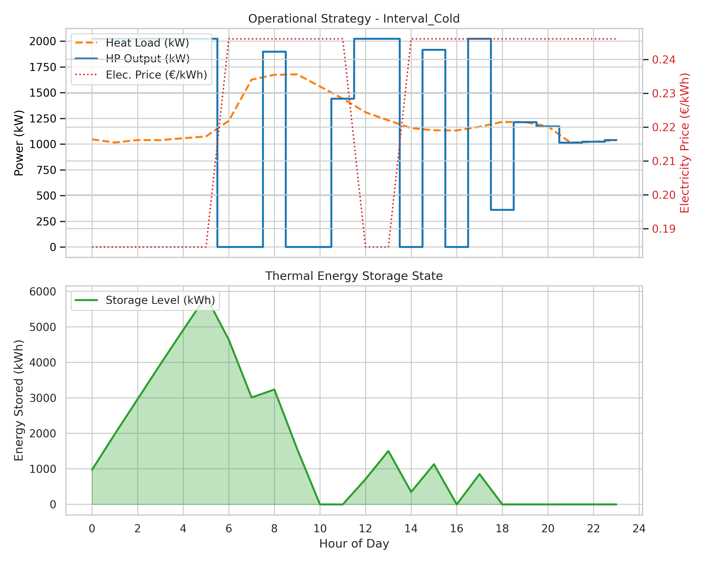
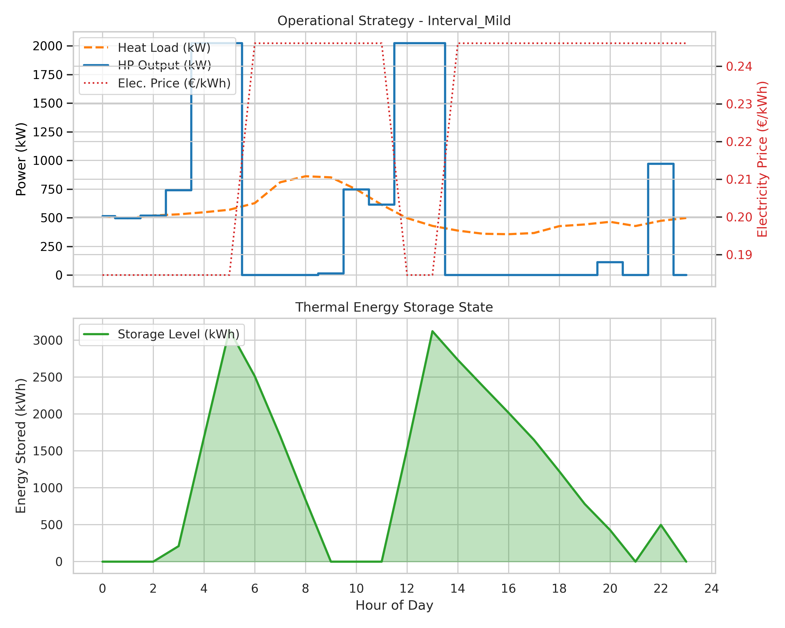
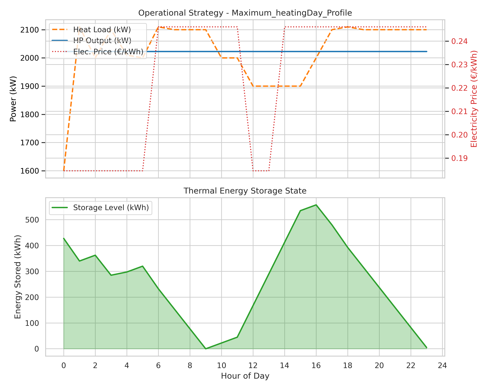
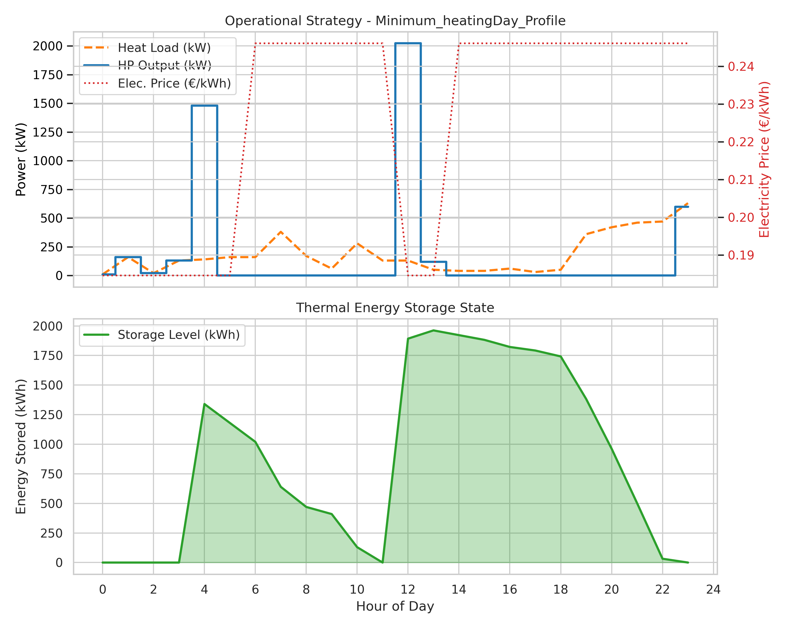

# Thermal Energy Storage (TES) Optimization Project

## 1. Project Overview
This project optimizes the sizing of a **Heat Pump (HP)** and a **Thermal Energy Storage (TES)** tank for a District Heating Network (DHN). The goal is to minimize the **Total Annualized Cost (TOTEX)** while satisfying the hourly heat demand of the network.

---

## 2. Optimization Results (Executive Summary)

### ✅ Optimal System Sizing
* **Heat Pump Capacity ($P_{hp\_max}$):** 2.0225 MW
* **Storage Tank Volume ($V_{tank}$):** 190.99 m³

### 💰 Economic Analysis
* **Total Annualized Cost:** 676.86 k€
    * **Annualized CAPEX:** 240.09 k€
    * **Annual OPEX:** 436.77 k€
* **Total Initial Investment (CAPEX):** 3262.93 k€
* **Net Present Cost (NPC) over 20 years:** 9198.73 k€

---

## 3. Mathematical Model & Methodology

### 3.1. Physical Parameters
The model uses a physics-based approach to calculate system performance.

* **Heat Pump COP (Lorentz Efficiency):**
    The Coefficient of Performance is modeled using the Lorentz efficiency with a system efficiency factor ($\eta_{sys} = 0.50$).

    $$ COP = \eta_{sys} \cdot \frac{T_{sink, K}}{T_{sink, K} - T_{source, K}} $$

    Where:
    * $T_{source, K} = T_{amb} + 273.15$ (Air Temperature)
    * $T_{sink, K} = \frac{T_{supply} + T_{return}}{2} + 273.15$ (Mean Water Temperature)
    * $T_{return} = 55.0^\circ C$ (Fixed)
    * $T_{supply}$ varies by day type (Climate Curve).

* **Storage Energy Density:**
    The energy storage capacity depends on the supply temperature for the specific day type.

    $$ \rho_{energy} [kWh/m^3] = \frac{\rho_{water} \cdot c_p \cdot (T_{supply} - T_{return})}{3600} $$

    * $\rho_{water} \approx 1000 kg/m^3$
    * $c_p \approx 4.18 kJ/kgK$

### 3.2. Economic Parameters
* **Annuity Factor ($\alpha$):**
    Used to annualize the initial CAPEX over the project lifetime.

    $$ \alpha = \frac{r(1+r)^N}{(1+r)^N - 1} = 0.0736 $$

    * Discount Rate ($r$): 4.0%
    * Lifetime ($N$): 20 years

### 3.3. Optimization Problem (MILP)
The problem is formulated as a Mixed-Integer Linear Program (MILP) solved using `PuLP`.

**Objective Function:** Minimize Total Annual Cost
$$ C_{total} = CAPEX_{annual} + OPEX_{annual} $$

1.  **CAPEX:**
    $$ CAPEX_{annual} = \alpha \cdot (P_{hp}^{cap} \cdot 1500 + V_{tank} \cdot 1200) $$

2.  **OPEX:**
    $$ OPEX_{annual} = \sum_{days} W_{day} \sum_{h=0}^{23} \left( \frac{Q_{hp}(h)}{COP_{day}} \cdot Price_{elec}(h) \right) $$

**Constraints:**
1.  **Power Limit:** $Q_{hp}(h) \le P_{hp}^{cap}$
2.  **Storage Limit:** $E_{stored}(h) \le V_{tank} \cdot \rho_{energy}(day)$
3.  **Energy Balance:** $E_{stored}(h) = E_{stored}(h-1) + Q_{hp}(h) - Load(h)$
4.  **Cyclic Constraint:** $E_{stored}(24) = E_{stored}(0)$

---

## 4. Code Structure & Logic Explained
The Python script `optimize_tes.py` is structured into a class `TESOptimizer` that handles the entire workflow:

1.  **`load_data()`**:
    * Reads hourly heat load profiles and temperature data from Excel.
    * **Crucial Step:** Converts heat loads from **MW** to **kW** to ensure consistency with cost parameters (€/kW).

2.  **`calculate_parameters()`**:
    * Computes the **COP** and **Storage Density** for each specific day type based on ambient and supply temperatures.
    * Generates the electricity price profile (Peak/Off-Peak hours) for France 2026.

3.  **`build_and_solve()` (The Core)**:
    * Constructs the MILP model using the `PuLP` library.
    * Defines decision variables: Heat Pump Size ($P_{hp\_max}$) and Tank Volume ($V_{tank}$).
    * Sets up the objective function (minimize cost) and physical constraints (energy balance, capacity limits).
    * Solves the problem to find the global optimum.

4.  **`visualize_results()`**:
    * Generates dual-axis plots using `matplotlib`.
    * Visualizes the "Load Shifting" strategy: showing how the Heat Pump ramps up during low-price hours to charge the storage.

---

## 5. Operational Strategy
The system minimizes costs by shifting heat production to off-peak electricity hours and storing it for peak hours.
* **Off-Peak Hours (0.1846 €/kWh):** 00:00-06:00, 12:00-14:00.
* **Peak Hours (0.2461 €/kWh):** 06:00-12:00, 14:00-24:00.

The Heat Pump tends to run at higher capacity during off-peak times to charge the storage tank, which then discharges during peak times to satisfy the heat load, thereby avoiding expensive electricity.

## 6. Operational Profiles
Below are the detailed operational profiles for each day type.

### Interval_Cold

### Interval_Mild

### Maximum_heatingDay_Profile

### Minimum_heatingDay_Profile

## 7. Economic Benefit of Energy Storage
By introducing Thermal Energy Storage, the system achieves significant cost savings compared to a "Heat Pump Only" scenario.

| Metric | With Storage (Optimized) | No Storage (HP Only) | Savings |
| :--- | :--- | :--- | :--- |
| **Total Annual Cost** | **676.86 k€** | **711.36 k€** | **34.50 k€** |
| Annualized CAPEX | 240.09 k€ | 232.89 k€ | -7.21 k€ |
| Annual OPEX | 436.77 k€ | 478.47 k€ | 41.71 k€ |
| Initial CAPEX | 3262.93 k€ | 3165.00 k€ | -97.93 k€ |
| Heat Pump Size | 2.0225 MW | 2.1100 MW | - |
| Tank Volume | 190.99 m³ | 0.00 m³ | - |

> **Note:** "Savings" = (No Storage) - (With Storage). A positive value indicates the Storage scenario is cheaper.
